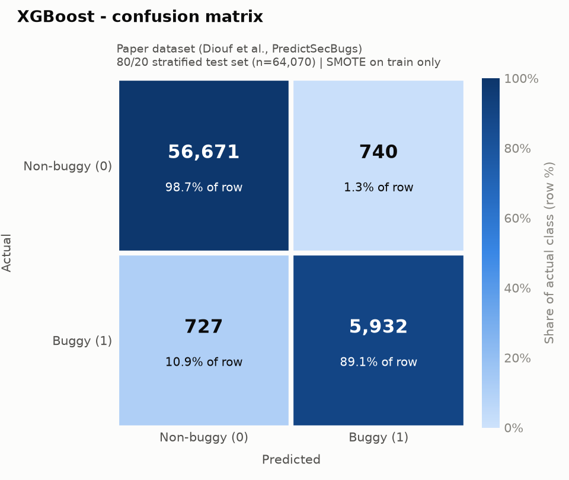
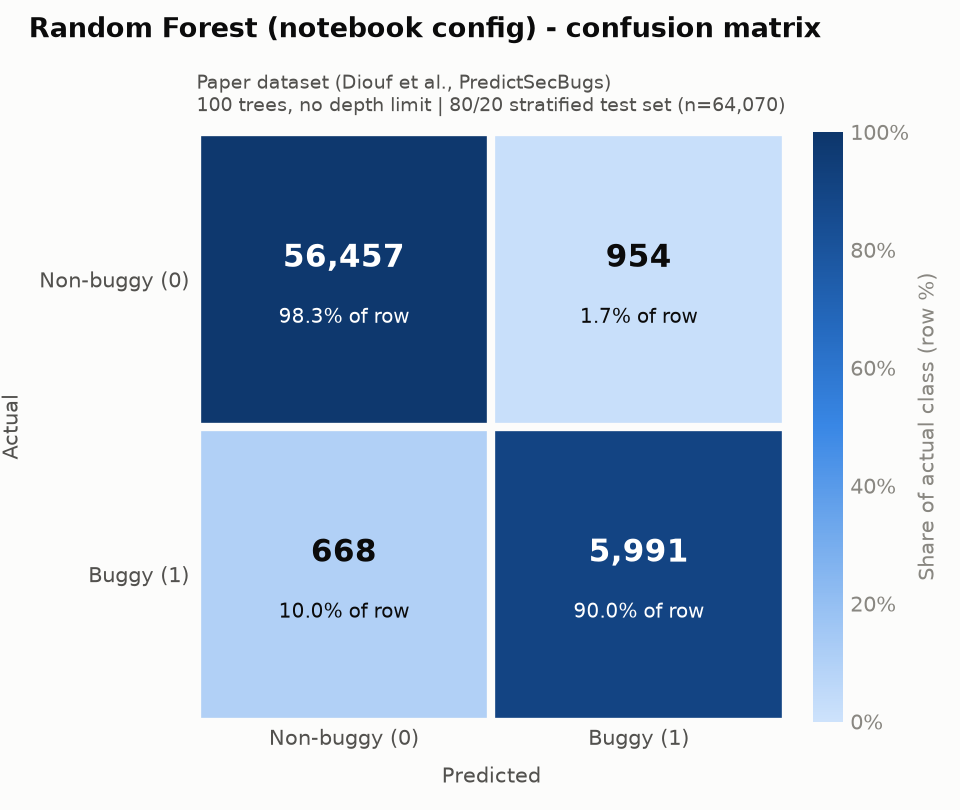
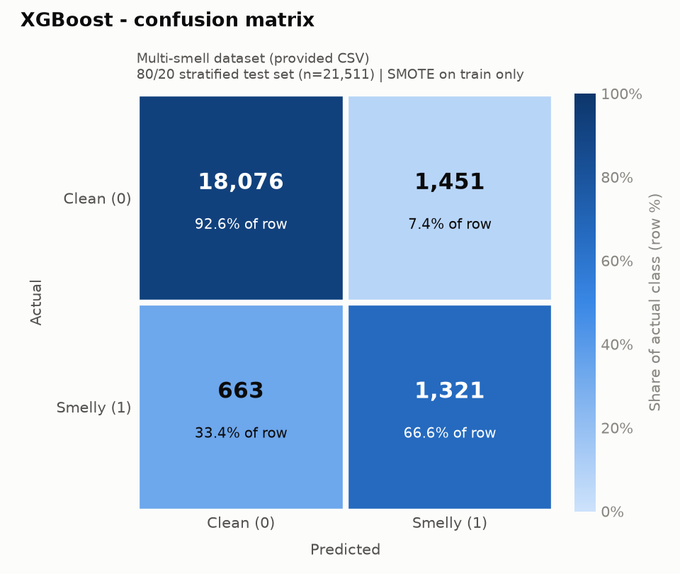
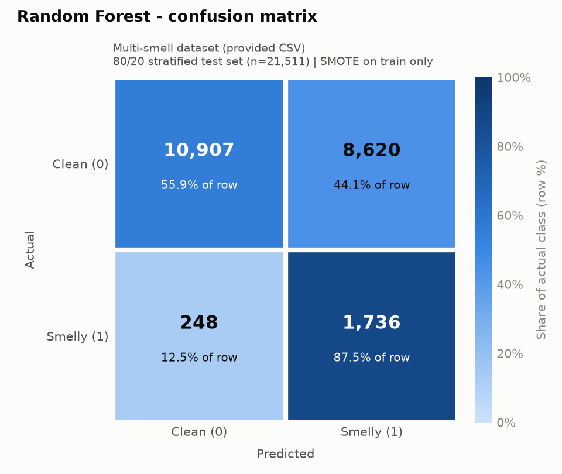

# Results Summary: Replicating Diouf et al. (2026)

**Paper:** M. Diouf, E. Toe, M. Grichi, H. Nakouri, F. Jaafar, *"Predicting Software Security Bugs Using Machine Learning and Quality Metrics: An Empirical Study"*, Computers, Materials & Continua 87(3), 2026. doi:10.32604/cmc.2026.077139 (`TSP_CMC_77139.pdf`).

**Models reproduced:** XGBoost (the paper's best model) and Random Forest (its second-best).
**Protocol:** 80/20 stratified train/test split, `random_state=42`, with SMOTE applied to the training data only.
**Code:** `replicate.py` runs the experiments and `make_summary.py` writes this report.

---

## 0. Read this first: the CSV in this folder is not the paper's dataset

| | Paper (Sec. 3.2.3) | `multi-smell-dataset-v1_2.csv` (provided) |
|---|---|---|
| Task | File-level **security-bug** prediction | Class/method-level **code-smell** detection |
| Rows | 338,442 files (33,294 buggy, 9.84%) | 107,554 rows (9,918 with any smell, 9.22%) |
| Features | 25 SciTools *Understand* metrics (CountStmtExe, SumCyclomatic, …) + `extension`, `Ecosystem` | 14 Halstead/complexity metrics (Volume, Effort, Difficulty, Cyclomatic Complexity, …) + `Project` |
| Labels | `buggy` (0/1) | `Long method`, `God class`, `Feature envy`, `Data class` (0/1 each) |
| Ecosystems / language | 7 ecosystems, multi-language | 89 Apache Java projects |

None of the paper's 25 metrics, nor its `buggy` label, appear in the provided file. Because the paper links to its replication package (github.com/MdioufDataScientist/PredictSecBugs), I **ran the pipeline twice**:

* **A. The provided CSV**, as the task instructs. The binary target `smelly` is 1 if any of the four smell flags is 1. This is the closest analogue to the paper's binary `buggy` label, and the positive rate is similar (9.22% vs 9.84%). These results show the paper's method applied to a different problem, so they **cannot** be compared to Table 15 like-for-like.
* **B. The authors' public dataset** (`paper_dataset/result_total_bon.csv`, downloaded from the repository above, together with the authors' notebook `ML.ipynb`). This is the real replication, and the comparison in Section 6 is based mainly on it.

---

## 1. The paper in brief

* **Problem:** can static, file-level software-quality metrics predict which source files contain security bugs (RQ3)? RQ1 covers feature importance and RQ2 covers thresholds, such as the "3x rule".
* **Data:** 7,685 security bugs from OSV across GHSA, PyPI, OSS-Fuzz, npm, Packagist, Maven and NuGet. Files modified in a security-fixing commit are labelled `buggy = 1`; all other files in the same repository snapshot are labelled 0. There are 25 Understand metrics per file, plus metadata (extension, ecosystem, commit date/SHA, before/after source).
* **Preprocessing (paper Sec. 4.3 and the authors' notebook):** remove duplicate files; check data types and missing values (none found); one-hot encode categoricals; mean-impute and StandardScale numerics; apply SMOTE to training folds only (it beat random oversampling and ADASYN); keep temporal order.
* **Models (11):** KNN (k=3), Decision Tree (depth 3), Random Forest (10 trees, depth 3, max_features=1), MLP, AdaBoost (50), XGBoost (defaults), Naive Bayes, QDA, Linear SVM, RBF SVM and Logistic Regression.
* **Evaluation:** 5-fold time-series cross-validation; Accuracy, Precision, Recall, F1, MCC and ROC-AUC. The best model is XGBoost: Acc 0.98, P 0.95, R 0.82, F1 0.88, MCC 0.87, AUC 0.91.

---

## 2. Dataset inspection

Full dumps are in `outputs/<dataset>/data_inspection.txt`.

### A. Provided CSV: `multi-smell-dataset-v1_2.csv`
* **Shape:** 107,554 rows x 21 columns (618 MB, mostly the raw `Code` text column). Exact duplicate rows across all columns, including the code text: **0**.
* **Columns and types:**
  * Identifiers / text: `File`, `Project`, `Class` and `Code` (strings).
  * Numeric features (14):
    * int: Logical Lines, Distinct/Total Operators, Distinct/Total Operands, Vocabulary, Length, Cyclomatic Complexity
    * float: Calculated Length, Volume, Difficulty, Effort, Time Required, Bugs (Halstead's estimate, not a label)
  * Labels (4 x int 0/1): Long method, God class, Feature envy, Data class.
* **Missing values:** none in any column.
* **Label distribution:** Long method 1,566 (1.46%); God class 4,333 (4.03%); Feature envy 1,996 (1.86%); Data class 3,284 (3.05%).
* **Target used:** `smelly` = any smell. 97,636 clean (90.78%) and 9,918 smelly (9.22%), so imbalanced at about 1:10.
* **Other notes:** the data is heavily right-skewed; for example Effort has a median of 587 and a maximum of 2.8e9. 31.4% of rows repeat another row's feature vector and label, mostly tiny or empty classes.

### B. Paper dataset: `result_total_bon.csv`
* **Shape:** 338,443 rows x 39 columns, which matches the paper's 338,442 (off by one). Three `Unnamed: 0*` index columns were dropped.
* **Columns and types:**
  * 26 float metrics. The paper says "25", but the authors' notebook uses these 26, including SumEssential and AvgEssential.
  * Categoricals: `extension` (11 values: .py, .c, .h, .php, .js, .cpp, .java, .cc, .ts, .hpp, .hh) and `Ecosystem` (7).
  * Metadata: `Name`, `commit_date`, `commit_sha`, `file_path`, `Commit_id`, `Source` (before/after) and `key`.
* **Missing values:** none.
* **Target `buggy`:** 305,149 non-buggy (90.16%) and 33,294 buggy (9.84%). This matches the paper exactly.
* **Labelling structure:** `buggy = 1` occurs **only** on `Source = before` rows. The post-fix version of a buggy file is always labelled 0.
* **Duplicates:** **18,095** rows are exact duplicates on every non-index column and were removed (paper step 1), leaving 320,348 rows. A further 63.2% of the remaining rows share an identical feature vector and label with another row. In 96% of these duplicate groups, every row has the same `file_path`: the same unchanged file was captured in several commit snapshots. Only 77 rows have all-zero metrics.

---

## 3. Preprocessing replicated, with assumptions

| Step | Paper / notebook | What I did | Assumption? |
|---|---|---|---|
| Duplicate removal | "Removed duplicate files" | Drop rows that are identical on every column (paper data: excluding the 3 index columns; CSV: including `Code`) | **Yes.** The paper says it removed "identical files across commits that remained unchanged", but its reported N (338,442) equals the raw file, so in practice nothing was removed. I removed only exact copies for the main run. The paper's wording, one row per unchanged file (n = 117,742), is tested as a sensitivity run. |
| Missing values | None found; notebook mean/mode-imputes | Same imputers kept inside the pipeline (no effect, since nothing is missing) | – |
| Features | 25 metrics; notebook also uses `extension`, `Ecosystem`, `commit_date` | Paper data: 26 metrics + `extension` + `Ecosystem`. CSV: 14 metrics + `Project` (the analogue of `Ecosystem`). `File`, `Class` and `Code` are dropped as identifiers or raw text. | **Yes.** `commit_date` is excluded because the paper says models predict "solely from quality metrics", and a timestamp would leak project identity under a random split. |
| Encoding | One-hot (notebook) | `OneHotEncoder(handle_unknown="ignore")` | – |
| Scaling | StandardScaler (notebook) | `StandardScaler` on numeric columns | – |
| Feature selection | RQ1 ranks features, but RQ3 trains on all metrics (notebook) | All features used, with no selection | **Yes,** following the notebook |
| Imbalance | SMOTE on training data only | `SMOTE(random_state=42)` inside an `imblearn` Pipeline, so it runs only at `fit` time | – |
| Split | 5-fold time-series CV | **80/20 stratified random split, `random_state=42`** (as the task requires). The paper's time-series CV is repeated as a sensitivity run. | Required by the task |
| Target (CSV only) | – | `smelly` = OR of the 4 smell flags | **Yes,** binary to mirror `buggy` |

The full pipeline saved in each `.pkl` is `ColumnTransformer(one-hot + impute/scale) -> SMOTE -> classifier`. It accepts a raw DataFrame with the feature columns, and SMOTE is skipped at prediction time.

## 4. Models (paper Table 4 hyper-parameters)

| Model | Hyper-parameters |
|---|---|
| XGBoost | defaults (`XGBClassifier(random_state=42)`) |
| Random Forest | `n_estimators=10, max_depth=3, max_features=1, random_state=42` |
| *Extra:* Random Forest, notebook config | `n_estimators=100`, no depth limit, `random_state=42` (paper dataset only; see Observation 2) |

Training and test sizes:

* **Paper dataset:** 256,278 train (26,635 buggy) and 64,070 test (6,659 buggy).
* **Provided CSV:** 86,043 train (7,934 smelly) and 21,511 test (1,984 smelly).

---

## 5. Results

### 5.1 Paper dataset (security bugs). This is the actual replication.
#### XGBoost

| Accuracy | MCC | ROC-AUC (proba) | ROC-AUC (hard labels) |
|---:|---:|---:|---:|
| 0.9771 | 0.8772 | 0.9941 | 0.9390 |

Per-class and averaged precision / recall / F1:

| Class | Precision | Recall | F1-score | Support |
|---|---:|---:|---:|---:|
| Non-buggy (0) | 0.9873 | 0.9871 | 0.9872 | 57,411 |
| Buggy (1) | 0.8891 | 0.8908 | 0.8900 | 6,659 |
| macro avg | 0.9382 | 0.9390 | 0.9386 | 64,070 |
| **weighted avg** | **0.9771** | **0.9771** | **0.9771** | 64,070 |

Confusion matrix (rows = actual, columns = predicted):

| | Pred. Non-buggy (0) | Pred. Buggy (1) |
|---|---:|---:|
| **Actual Non-buggy (0)** | 56,671 (TN) | 740 (FP) |
| **Actual Buggy (1)** | 727 (FN) | 5,932 (TP) |



Classification report:

```
                  precision   recall  f1-score  support

   Non-buggy (0)     0.9873   0.9871    0.9872    57411
       Buggy (1)     0.8891   0.8908    0.8900     6659

        accuracy                        0.9771    64070
       macro avg     0.9382   0.9390    0.9386    64070
    weighted avg     0.9771   0.9771    0.9771    64070
```

#### Random Forest

| Accuracy | MCC | ROC-AUC (proba) | ROC-AUC (hard labels) |
|---:|---:|---:|---:|
| 0.5988 | 0.2894 | 0.8706 | 0.7370 |

Per-class and averaged precision / recall / F1:

| Class | Precision | Recall | F1-score | Support |
|---|---:|---:|---:|---:|
| Non-buggy (0) | 0.9821 | 0.5625 | 0.7153 | 57,411 |
| Buggy (1) | 0.1946 | 0.9115 | 0.3208 | 6,659 |
| macro avg | 0.5884 | 0.7370 | 0.5181 | 64,070 |
| **weighted avg** | **0.9002** | **0.5988** | **0.6743** | 64,070 |

Confusion matrix (rows = actual, columns = predicted):

| | Pred. Non-buggy (0) | Pred. Buggy (1) |
|---|---:|---:|
| **Actual Non-buggy (0)** | 32,295 (TN) | 25,116 (FP) |
| **Actual Buggy (1)** | 589 (FN) | 6,070 (TP) |


Classification report:

```
                  precision   recall  f1-score  support

   Non-buggy (0)     0.9821   0.5625    0.7153    57411
       Buggy (1)     0.1946   0.9115    0.3208     6659

        accuracy                        0.5988    64070
       macro avg     0.5884   0.7370    0.5181    64070
    weighted avg     0.9002   0.5988    0.6743    64070
```

#### Random Forest (notebook config)

| Accuracy | MCC | ROC-AUC (proba) | ROC-AUC (hard labels) |
|---:|---:|---:|---:|
| 0.9747 | 0.8669 | 0.9936 | 0.9415 |

Per-class and averaged precision / recall / F1:

| Class | Precision | Recall | F1-score | Support |
|---|---:|---:|---:|---:|
| Non-buggy (0) | 0.9883 | 0.9834 | 0.9858 | 57,411 |
| Buggy (1) | 0.8626 | 0.8997 | 0.8808 | 6,659 |
| macro avg | 0.9255 | 0.9415 | 0.9333 | 64,070 |
| **weighted avg** | **0.9752** | **0.9747** | **0.9749** | 64,070 |

Confusion matrix (rows = actual, columns = predicted):

| | Pred. Non-buggy (0) | Pred. Buggy (1) |
|---|---:|---:|
| **Actual Non-buggy (0)** | 56,457 (TN) | 954 (FP) |
| **Actual Buggy (1)** | 668 (FN) | 5,991 (TP) |



Classification report:

```
                  precision   recall  f1-score  support

   Non-buggy (0)     0.9883   0.9834    0.9858    57411
       Buggy (1)     0.8626   0.8997    0.8808     6659

        accuracy                        0.9747    64070
       macro avg     0.9255   0.9415    0.9333    64070
    weighted avg     0.9752   0.9747    0.9749    64070
```


### 5.2 Provided CSV (code smells)
#### XGBoost

| Accuracy | MCC | ROC-AUC (proba) | ROC-AUC (hard labels) |
|---:|---:|---:|---:|
| 0.9017 | 0.5108 | 0.9065 | 0.7958 |

Per-class and averaged precision / recall / F1:

| Class | Precision | Recall | F1-score | Support |
|---|---:|---:|---:|---:|
| Clean (0) | 0.9646 | 0.9257 | 0.9448 | 19,527 |
| Smelly (1) | 0.4766 | 0.6658 | 0.5555 | 1,984 |
| macro avg | 0.7206 | 0.7958 | 0.7501 | 21,511 |
| **weighted avg** | **0.9196** | **0.9017** | **0.9089** | 21,511 |

Confusion matrix (rows = actual, columns = predicted):

| | Pred. Clean (0) | Pred. Smelly (1) |
|---|---:|---:|
| **Actual Clean (0)** | 18,076 (TN) | 1,451 (FP) |
| **Actual Smelly (1)** | 663 (FN) | 1,321 (TP) |



Classification report:

```
                  precision   recall  f1-score  support

       Clean (0)     0.9646   0.9257    0.9448    19527
      Smelly (1)     0.4766   0.6658    0.5555     1984

        accuracy                        0.9017    21511
       macro avg     0.7206   0.7958    0.7501    21511
    weighted avg     0.9196   0.9017    0.9089    21511
```

#### Random Forest

| Accuracy | MCC | ROC-AUC (proba) | ROC-AUC (hard labels) |
|---:|---:|---:|---:|
| 0.5877 | 0.2511 | 0.7583 | 0.7168 |

Per-class and averaged precision / recall / F1:

| Class | Precision | Recall | F1-score | Support |
|---|---:|---:|---:|---:|
| Clean (0) | 0.9778 | 0.5586 | 0.7110 | 19,527 |
| Smelly (1) | 0.1676 | 0.8750 | 0.2814 | 1,984 |
| macro avg | 0.5727 | 0.7168 | 0.4962 | 21,511 |
| **weighted avg** | **0.9030** | **0.5877** | **0.6713** | 21,511 |

Confusion matrix (rows = actual, columns = predicted):

| | Pred. Clean (0) | Pred. Smelly (1) |
|---|---:|---:|
| **Actual Clean (0)** | 10,907 (TN) | 8,620 (FP) |
| **Actual Smelly (1)** | 248 (FN) | 1,736 (TP) |



Classification report:

```
                  precision   recall  f1-score  support

       Clean (0)     0.9778   0.5586    0.7110    19527
      Smelly (1)     0.1676   0.8750    0.2814     1984

        accuracy                        0.5877    21511
       macro avg     0.5727   0.7168    0.4962    21511
    weighted avg     0.9030   0.5877    0.6713    21511
```


---

## 6. Comparison with the paper

The paper's Table 15 reports precision, recall and F1 for the **positive (buggy) class**. Accuracy confirms this: at 9.84% prevalence, P = 0.95 and R = 0.82 imply an accuracy of about 0.978, which matches the reported 0.98, whereas weighted averages would all be about 0.98. The "Reproduced" columns therefore show positive-class values. Weighted averages are in Section 5.

| Model | Metric | Paper's reported (Table 15) | Reproduced: paper dataset | Reproduced: provided CSV (code smells) |
|---|---|---:|---:|---:|
| XGBoost (Table 4 config) | Accuracy | 0.98 | 0.9771 | 0.9017 |
| XGBoost (Table 4 config) | Precision (positive class) | 0.95 | 0.8891 | 0.4766 |
| XGBoost (Table 4 config) | Recall (positive class) | 0.82 | 0.8908 | 0.6658 |
| XGBoost (Table 4 config) | F1 (positive class) | 0.88 | 0.8900 | 0.5555 |
| XGBoost (Table 4 config) | MCC | 0.87 | 0.8772 | 0.5108 |
| XGBoost (Table 4 config) | ROC-AUC (probability scores) | 0.91 | 0.9941 | 0.9065 |
| XGBoost (Table 4 config) | ROC-AUC (hard 0/1 labels) | – | 0.9390 | 0.7958 |
| Random Forest (Table 4 config) | Accuracy | 0.97 | 0.5988 | 0.5877 |
| Random Forest (Table 4 config) | Precision (positive class) | 0.89 | 0.1946 | 0.1676 |
| Random Forest (Table 4 config) | Recall (positive class) | 0.82 | 0.9115 | 0.8750 |
| Random Forest (Table 4 config) | F1 (positive class) | 0.85 | 0.3208 | 0.2814 |
| Random Forest (Table 4 config) | MCC | 0.84 | 0.2894 | 0.2511 |
| Random Forest (Table 4 config) | ROC-AUC (probability scores) | 0.90 | 0.8706 | 0.7583 |
| Random Forest (Table 4 config) | ROC-AUC (hard 0/1 labels) | – | 0.7370 | 0.7168 |
| Random Forest (authors' notebook config) | Accuracy | 0.97 | 0.9747 | – |
| Random Forest (authors' notebook config) | Precision (positive class) | 0.89 | 0.8626 | – |
| Random Forest (authors' notebook config) | Recall (positive class) | 0.82 | 0.8997 | – |
| Random Forest (authors' notebook config) | F1 (positive class) | 0.85 | 0.8808 | – |
| Random Forest (authors' notebook config) | MCC | 0.84 | 0.8669 | – |
| Random Forest (authors' notebook config) | ROC-AUC (probability scores) | 0.90 | 0.9936 | – |
| Random Forest (authors' notebook config) | ROC-AUC (hard 0/1 labels) | – | 0.9415 | – |

### Sensitivity analyses (to explain the differences)

| Dataset | Run | Accuracy | Precision | Recall | F1 | MCC | ROC-AUC (proba) | ROC-AUC (hard) |
|---|---|---:|---:|---:|---:|---:|---:|---:|
| Paper | **XGBoost, main run (80/20, exact-dup removal)** | 0.9771 | 0.8891 | 0.8908 | 0.8900 | 0.8772 | 0.9941 | 0.9390 |
| Paper | **Random Forest, main run (80/20, exact-dup removal)** | 0.5988 | 0.1946 | 0.9115 | 0.3208 | 0.2894 | 0.8706 | 0.7370 |
| Paper | XGBoost, feature-level dedup (n=117,742) | 0.9518 | 0.9256 | 0.8639 | 0.8937 | 0.8635 | 0.9890 | 0.9213 |
| Paper | Random Forest, feature-level dedup (n=117,742) | 0.6591 | 0.4044 | 0.9618 | 0.5693 | 0.4505 | 0.8987 | 0.7642 |
| Paper | XGBoost, paper protocol: TimeSeriesSplit(5) mean | 0.9687 | 0.8352 | 0.8513 | 0.8426 | 0.8256 | 0.9890 | – |
| Paper | Random Forest, paper protocol: TimeSeriesSplit(5) mean | 0.5817 | 0.1890 | 0.9388 | 0.3144 | 0.2905 | 0.8929 | – |
| Paper | Random Forest, notebook config (100 trees, no depth limit), 80/20 | 0.9747 | 0.8626 | 0.8997 | 0.8808 | 0.8669 | 0.9936 | 0.9415 |
| Provided CSV | **XGBoost, main run (80/20, exact-dup removal)** | 0.9017 | 0.4766 | 0.6658 | 0.5555 | 0.5108 | 0.9065 | 0.7958 |
| Provided CSV | **Random Forest, main run (80/20, exact-dup removal)** | 0.5877 | 0.1676 | 0.8750 | 0.2814 | 0.2511 | 0.7583 | 0.7168 |
| Provided CSV | XGBoost, feature-level dedup (n=73,765) | 0.9073 | 0.5965 | 0.6284 | 0.6120 | 0.5597 | 0.8906 | 0.7862 |
| Provided CSV | Random Forest, feature-level dedup (n=73,765) | 0.8528 | 0.3984 | 0.5195 | 0.4510 | 0.3720 | 0.7330 | 0.7081 |

Per-fold recall with the paper's time-series protocol:
* XGBoost: [0.9432, 0.9062, 0.8358, 0.7761, 0.7952]
* Random Forest (Table 4 config): [0.9737, 0.9534, 0.9257, 0.8975, 0.9438]

---

## 7. Observations

1. **XGBoost replicates well.** On the authors' data, accuracy (0.977 vs 0.98), F1 (0.890 vs 0.88) and MCC (0.877 vs 0.87) are within about 0.01 of Table 15. My model trades a little precision (0.889 vs 0.95) for higher recall (0.891 vs 0.82). With the paper's own time-series protocol, XGBoost gives F1 0.843, MCC 0.826 and recall 0.851, which is also close. The paper's headline result holds up.

2. **Random Forest does not replicate with Table 4's hyper-parameters, but does with the authors' notebook settings.** With `max_depth=3, n_estimators=10, max_features=1` (Table 4), the forest is too shallow to learn the SMOTE-balanced boundary. It flags 25,116 of 57,411 clean files, giving precision 0.195, recall 0.912 and F1 0.321 (paper: 0.89 / 0.82 / 0.85). The same shortfall appears under the time-series protocol (F1 0.314), so the split is not the cause. The RandomForest in the authors' notebook (`n_estimators=100`, no depth limit) gives Acc 0.975, P 0.863, R 0.900, F1 0.881 and MCC 0.867, which is in line with Table 15. **Most likely the Table 15 RF numbers came from the notebook configuration, and Table 4 is mis-reported.**

3. **The paper's ROC-AUC is most likely computed from hard 0/1 predictions, not probabilities.** My probability-based AUC is 0.994 (XGBoost), far above the paper's 0.91. AUC computed on hard labels equals (TPR + TNR)/2. Applying that to the paper's own Table 15 reproduces every row I checked: XGBoost (0.82 + ~0.995)/2 ≈ 0.91; RF ≈ 0.90; KNN (0.48 + ~0.985)/2 ≈ 0.73; LR (0.03 + ~0.99)/2 ≈ 0.51. My hard-label AUC (XGBoost 0.939, notebook RF 0.942) is in the same range as the paper's values. If this is right, the paper *understates* its models' ranking ability.

4. **Random vs time-ordered split.** The random 80/20 split mixes years, so the test set comes from the same projects and periods as the training set. Under the paper's chronological TimeSeriesSplit, XGBoost recall falls from 0.94 in the earliest fold to 0.78 in later folds. This is the concept drift the paper mentions, and it is why the random-split numbers are somewhat optimistic.

5. **Duplicate rows inflate accuracy, not the minority-class metrics.** 63% of rows in the paper's data share a feature vector and label with another row. In 96% of those groups, the rows are the same `file_path` repeated: the same unchanged file was re-collected for each security-fixing commit in the repository. The paper says these were removed (Sec. 4.3, step 1), but the published file and the reported N still contain them. When I keep one row per unique (features, label) pair, accuracy falls from 0.977 to 0.952, because many easy, repeated clean files are gone. F1 (0.894) and MCC (0.863) barely change, so the predictive signal is real. Note also that the post-fix version of every buggy file is labelled 0 while its nearly identical pre-fix version is labelled 1. This label noise is built into the dataset design.

6. **Some of the performance may come from ecosystem and file type rather than security-specific structure.** I did not test this directly. Buggy rates differ a lot by ecosystem (OSS-Fuzz 12.5% vs npm 2.9%), and `extension` is among the paper's top-6 features. Paper data: `commit_date` was excluded, though the authors' notebook includes it. Including it would likely raise random-split scores further through project and time leakage.

7. **Internal inconsistencies in Table 15** (not in my two models): Linear SVM (P 0.35, R 0.30, F1 0.52) and RBF SVM (P 0.29, R 0.36, F1 0.47) report F1 values that are mathematically impossible. F1 is the harmonic mean, so it must lie between P and R (about 0.32 in both cases).

8. **Provided CSV (code smells).** The same pipeline is much weaker at code-smell detection: XGBoost reaches F1 0.556, MCC 0.511 and probability ROC-AUC 0.906. The paper-style shallow RF reaches high recall (0.875) but very low precision (0.168), the same failure mode as on the paper data. There are two likely reasons:
   * Size and complexity metrics suit some smells better than others. XGBoost's recall on the test set is 0.93 for *God class*, 0.61 for *Long method*, 0.53 for *Feature envy* and 0.43 for *Data class*. Feature envy (coupling to other classes) and Data class (accessor-only classes) are not size/complexity properties, and the any-smell target mixes all four.
   * The dataset has no ecosystem or extension signal and is single-language.

   Feature-level dedup changes little (XGBoost F1 0.612). These numbers are a demonstration of the method on a different task, **not** a replication of the paper's numbers.

---

## 8. Files produced

```
replicate.py                      # full pipeline (both datasets)
make_summary.py                   # builds this report from outputs/results.json
results_summary.md                # this file
outputs/results.json              # every metric, confusion matrix and classification report
outputs/paper_dataset/
    xgboost_model.pkl  random_forest_model.pkl  random_forest_notebook_config_model.pkl
    confusion_matrix_xgboost.png  confusion_matrix_random_forest.png  confusion_matrix_random_forest_notebook_config.png
    classification_report_*.txt   data_inspection.txt
outputs/local_smell_dataset/
    xgboost_model.pkl  random_forest_model.pkl
    confusion_matrix_xgboost.png  confusion_matrix_random_forest.png
    classification_report_*.txt   data_inspection.txt
paper_dataset/                    # authors' dataset + notebook (downloaded from GitHub)
```

To reproduce: `pip install scikit-learn imbalanced-learn xgboost pandas matplotlib joblib`, then run `python replicate.py`, then `python make_summary.py`.

Load a model with `joblib.load("outputs/paper_dataset/xgboost_model.pkl").predict(df[feature_cols])`.

Environment: Python 3.13, scikit-learn, imbalanced-learn, xgboost (see `pip list`).
